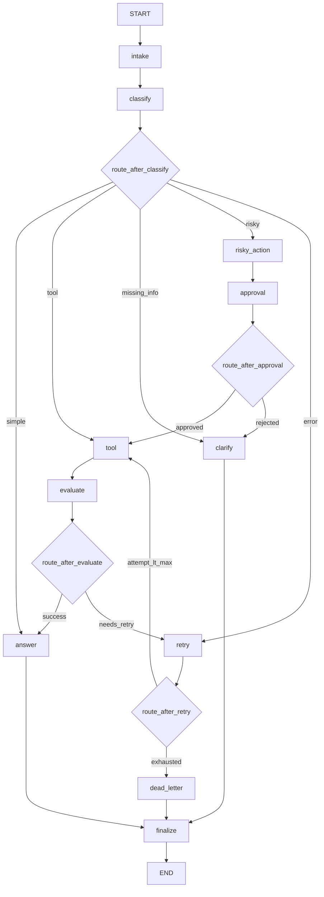

# Day 08 Lab Report

## 1. Team / student

- Name: Ho Trung Tin
- Student ID: 2A202601688
- Repo: https://github.com/tinstins23/phase2-k3-4-track3-day8-langgraph-agent-2A202601688-HoTrungTin
- Branch: `dev`
- Date: 2026-08-25

## 2. Architecture

Support-ticket agent trên LangGraph với **11 node**: intake, classify, tool, evaluate, answer, clarify, risky_action, approval, retry, dead_letter, finalize.

Luồng chính:

- **classify** dùng LLM structured output (priority: risky > tool > missing_info > error > simple)
- **tool → evaluate** tạo bounded retry loop khi tool trả ERROR
- **risky → approval → tool** cho HITL path (mock approve mặc định)
- Mọi nhánh kết thúc tại **finalize → END**

## 3. State schema

| Field             | Reducer   | Why                       |
| ----------------- | --------- | ------------------------- |
| messages          | append    | audit conversation/events |
| tool_results      | append    | lưu kết quả tool calls    |
| errors            | append    | log lỗi retry             |
| events            | append    | audit trail cho grading   |
| route             | overwrite | route hiện tại            |
| evaluation_result | overwrite | gate retry loop           |
| pending_question  | overwrite | câu hỏi làm rõ            |
| proposed_action   | overwrite | hành động risky chờ duyệt |
| approval          | overwrite | quyết định HITL           |
| attempt           | overwrite | đếm retry                 |
| final_answer      | overwrite | câu trả lời cuối          |

## 4. Scenario results

| Metric            | Value |
| ----------------- | ----: |
| Total scenarios   |     7 |
| Success rate      |  100% |
| Avg nodes visited |   6.4 |
| Total retries     |     3 |
| Total interrupts  |     2 |

| Scenario        | Expected route | Actual route | Success | Retries | Interrupts |
| --------------- | -------------- | ------------ | ------: | ------: | ---------: |
| S01_simple      | simple         | simple       |     Yes |       0 |          0 |
| S02_tool        | tool           | tool         |     Yes |       0 |          0 |
| S03_missing     | missing_info   | missing_info |     Yes |       0 |          0 |
| S04_risky       | risky          | risky        |     Yes |       0 |          1 |
| S05_error       | error          | error        |     Yes |       2 |          0 |
| S06_delete      | risky          | risky        |     Yes |       0 |          1 |
| S07_dead_letter | error          | error        |     Yes |       1 |          0 |

## 5. Failure analysis

1. **Retry / tool failure**: Khi route=error và attempt < 2, tool_node trả ERROR → evaluate needs_retry → retry. Nếu attempt >= max_attempts → dead_letter (S07 với max_attempts=1).
2. **Risky action without approval**: risky_action chỉ chuẩn bị proposed_action; approval_node ghi HITL. Reject → clarify thay vì tool.

## 6. Persistence / recovery evidence

- MemorySaver dùng cho test/CI mặc định (`configs/lab.yaml`).
- SqliteSaver (extension) hỗ trợ WAL mode tại `outputs/checkpoints.db`.
- Mỗi scenario dùng `thread_id=thread-{scenario.id}` qua CLI.
- `resume_success=false` — chưa demo crash-resume.

## 7. Extension work

- SQLite checkpointer với WAL mode
- Mermaid diagram (xem section Architecture)
- Optional HITL interrupt qua `LANGGRAPH_INTERRUPT=true`

## 8. Improvement plan

- Crash recovery demo + set resume_success=true
- Real HITL với Streamlit UI + interrupt/resume
- LLM-as-judge cho evaluate_node (heuristic làm fallback)
